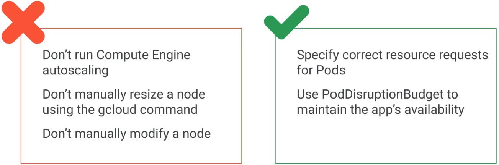

# What is Kubernetes
Kubernetes is a
- Opensource **container orchestration tool**
- Developed by **Google**
- Helps you manage **containerized applications in different deployment environments**

# What is Archestration

